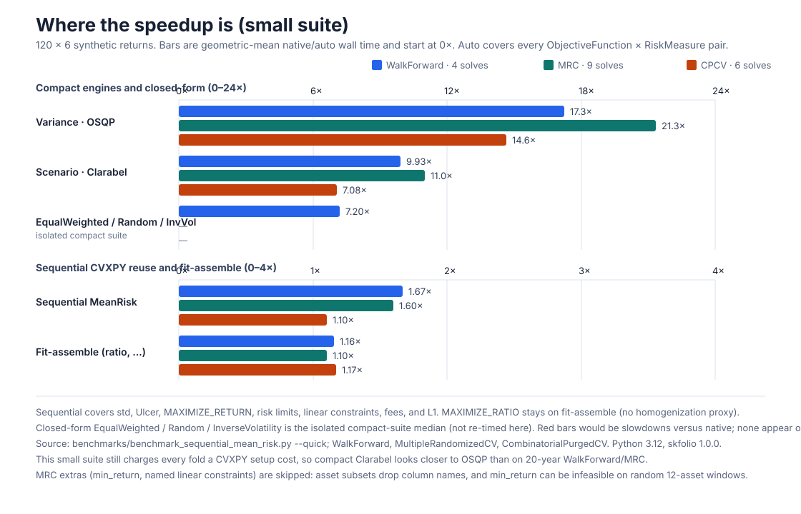
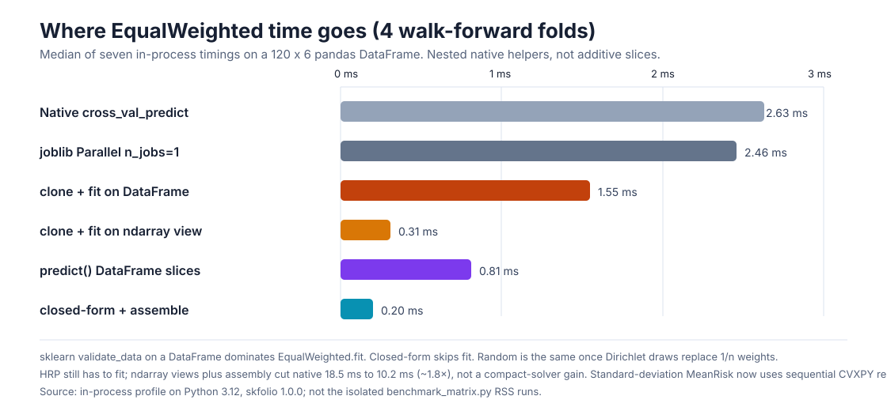
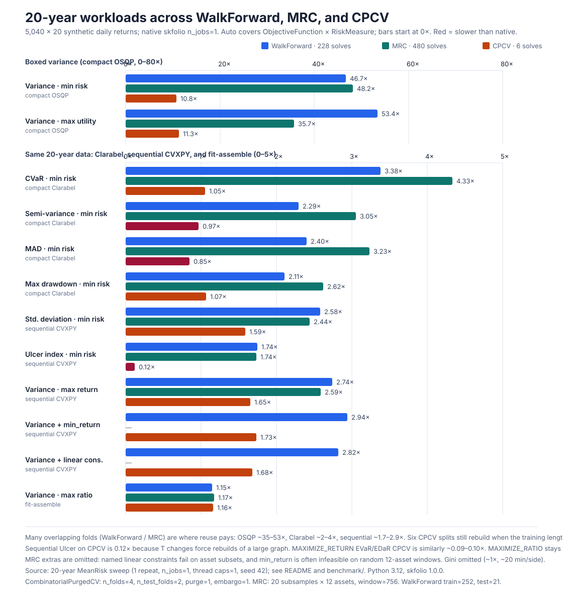

# skfolio-accelerate

`skfolio-accelerate` makes large skfolio backtests less repetitive. It provides
a drop-in replacement for `skfolio.model_selection.cross_val_predict`, so an
existing backtest usually needs one import change:

```python
from skfolio.model_selection import WalkForward
from skfolio.optimization import MeanRisk
from skfolio_accelerate import cross_val_predict

cv = WalkForward(train_size=2 * 252, test_size=21)
prediction = cross_val_predict(MeanRisk(), X, cv=cv)
```

The result is still a skfolio `MultiPeriodPortfolio` or `Population`.

Internally a call is compiled once (`cv_plan`) then executed: overlapping
training moments are updated from sufficient statistics, a compact OSQP or
Clarabel engine reuses a fixed problem shape across folds, and test portfolios
are assembled from `weights_`. Estimators outside the compact subset still use
native `fit` plus that same assembly path.

## What it does

Backtests repeatedly fit nearly identical portfolios. This package recognises
the small set of cases where that repetition can be removed without changing
the portfolio problem:

- It updates empirical moments as a training window moves.
- It assembles CPCV training moments from fold blocks, including purge and
  embargo exclusions.
- It reuses the shape of an equivalent solver problem instead of rebuilding a
  CVXPY graph for every fold.
- It scores compact hyperparameter candidates from weights before constructing
  the final portfolio objects.
- It compiles the CV plan once and builds test portfolios from `weights_`, so
  serial calls skip joblib, `safe_split` copies, and `predict()` construction.

All reuse is local to one call. The package does not keep global caches of
returns, estimators, fitted priors, or portfolios.

The EqualWeighted speedup is this last step, not a hidden solver trick. Native
`cross_val_predict` still clones the estimator, validates a DataFrame/array
slice, wraps `n_jobs=1` in joblib, copies the test fold, and constructs a
`Portfolio` for every split. EqualWeighted has no optimisation, so removing
that CV tax is the whole gain. It is a roughly constant saving per fold, not a
multiplicative floor: a cheap estimator shows a large ratio; a CVXPY solve
that already dominates the fold only shrinks by that same overhead. Compact
MeanRisk already used the assembly path. Estimators that previously fell back
to native skfolio now get the same serial assembly unless they need sequential
`previous_weights`, a pipeline, parallel `n_jobs`, or another option that
changes how `predict` is called.

## When it helps

The fast path is deliberately narrow. It applies to:

- `MeanRisk` with the default empirical prior;
- minimize-risk or maximize-utility objectives;
- a fixed equality budget, ordinary scalar or per-asset weight bounds, and
  optional L2 regularisation;
- variance, semi-variance, semi-deviation, MAD, first lower partial moment,
  worst realization, CVaR, EVaR, maximum/average drawdown, CDaR, or EDaR;
- default `EqualWeighted`, `Random`, and default-empirical `InverseVolatility`.

Variance uses OSQP. The scenario-based risks use Clarabel because they are
LPs, QPs, second-order-cone problems, or exponential-cone problems. The
formulation is the same one skfolio uses: for example, the downside measures
use its minimum acceptable return, and drawdown keeps skfolio's ordered,
non-compounded recurrence.

Other serial estimators still call native `fit` so the original problem is
unchanged, then assemble test portfolios from `weights_`. That includes HRP,
risk budgeting, ratio objectives, risk limits, standard deviation, and similar
cases. Pipelines, sequential previous weights (transaction costs, turnover, or
a previous-weight fallback), `raise_on_failure=False`, parallel `n_jobs`, and
`entry_rebalancing_params` still run through skfolio unchanged.

This boundary is intentional. Reusing mutable estimator or solver state without
proving equivalence could silently solve a different investment problem.

Pass `return_report=True` if you want to see which path was selected:

```python
prediction, report = cross_val_predict(
    MeanRisk(),
    X,
    cv=cv,
    return_report=True,
)
print(report.backend)  # "osqp", "clarabel", "closed-form", "fit-assemble", or "sklearn"
```

`"sklearn"` means native skfolio was used. The report explains why. If a
compact numerical solve cannot finish, the package retries with native `fit`
and the assembled path rather than returning an accelerator-only failure.

## Checking a result

Use native skfolio as the reference when validating a new workload. Numerical
closeness does not automatically mean that a ranking is unchanged:

```python
from skfolio_accelerate import (
    ranking_precision_at_k,
    spearman_rank_correlation,
)

precision = ranking_precision_at_k(reference_scores, accelerated_scores, k=5)
correlation = spearman_rank_correlation(reference_scores, accelerated_scores)

# Treat score gaps below the numerical tolerance as ties.
tie_aware = ranking_precision_at_k(
    reference_scores,
    accelerated_scores,
    k=5,
    score_tolerance=1e-6,
)
```

Precision@k checks whether skfolio's best candidates remain in the best set.
The optional tolerance treats near-equal scores as ties. Spearman compares the
full ordering. It is `nan` when every score is the same.

## Parameter search

`grid_search` is for a large grid that remains inside the fast MeanRisk subset.
It scores candidates by mean out-of-sample Sharpe ratio and only constructs the
winning prediction. Use skfolio or sklearn search for general estimators.

```python
import numpy as np
from skfolio_accelerate import grid_search

result = grid_search(
    MeanRisk(),
    X,
    {"l2_coef": np.logspace(-5, -1, 16)},
    cv=cv,
)

print(result.best_params_)
print(result.best_score_)
prediction = result.best_prediction_
```

## Benchmarks

Measured results depend on data shape and the number of folds. The quick suite
uses synthetic data, repeats each run three times, and reports the median wall
time and process-tree peak RSS. It covers every risk measure and public
optimizer across WalkForward, purged CPCV, and MultipleRandomizedCV:

```bash
PYTHONPATH=src python benchmarks/benchmark_matrix.py --quick --repeats 3
```

On the benchmark VM (Python 3.12, skfolio 1.0.0), compact MeanRisk was
usually 5–30× faster in the small suite. EqualWeighted, Random, and
InverseVolatility were 4.5–13.2× because they skip native CV machinery.
Serial estimators that still call native `fit` (HRP, standard deviation)
picked up the shared assembly path at 1.2–1.7×. That is the same overhead
cut as EqualWeighted, not a 5–13× floor: the optimiser still dominates.
Pipelines and sequential previous weights stay on native skfolio (~1×).
One EVaR randomized case could not complete in Clarabel and automatically
retried with native `fit` plus assembly. Peak RSS was typically similar to
native because importing Python and skfolio dominates these small processes.





The more useful large test contains 5,040 daily returns. Native skfolio used
`n_jobs=1`; WalkForward made 228 solves and MRC made 480:

| Risk | WalkForward speedup | MRC speedup | max path Sharpe difference |
|---|---:|---:|---:|
| Variance | 62.1× | 75.3× | `4.3e-5` |
| Semi-variance | 2.3× | 3.0× | `1.1e-16` |
| MAD | 2.2× | 3.1× | `2.1e-6` |
| CVaR | 3.3× | 4.2× | `7.4e-6` |
| Max drawdown | 2.1× | 2.6× | `1.6e-7` |



Small six-solve CPCV cases are often near break-even for scenario risks because
fixed setup dominates. They are not included in the table above. For this
reason the project does not claim one universal speedup number.

Reproduce a focused 20-year run with:

```bash
PYTHONPATH=src python benchmarks/benchmark_matrix.py --repeats 3 \
  --only 'MeanRisk[VARIANCE]' \
  --only 'MeanRisk[SEMI_VARIANCE]' \
  --only 'MeanRisk[MEAN_ABSOLUTE_DEVIATION]' \
  --only 'MeanRisk[CVAR]' \
  --only 'MeanRisk[MAX_DRAWDOWN]'
```

Use `--native-n-jobs=-1` separately when comparing parallel throughput. Native
`n_jobs=1` is the correctness baseline. The CSV output keeps compact and
fallback rows separate and includes timing spread, peak RSS, numerical
difference, rankings, solver counts, and fallback reasons.

## Documentation

API reference, user guide, and gallery examples are built with Sphinx (numpydoc
+ pydata-sphinx-theme, matching skfolio's documentation style):

```bash
pip install -e ".[docs]"
cd docs && make html
```

Open `docs/_build/html/index.html`. Continuous integration builds the docs on
every pull request and publishes them to GitHub Pages from `main`.

## Installation and tests

The package targets skfolio 1.x. Its only additional runtime dependency is
OSQP; NumPy, SciPy, Clarabel, and scikit-learn come from skfolio's own runtime
stack.

```bash
python -m venv .venv
source .venv/bin/activate
pip install -e ".[dev]"
pytest
```

## Automation and releases

Every pull request and push to `main` runs Ruff, the complete test suite on
Python 3.10 through 3.14, a coverage report, and a wheel/sdist build with an
installation smoke test. Dependabot checks Python and GitHub Actions
dependencies weekly.

Publishing a non-prerelease GitHub Release automatically verifies the source,
checks that a tag such as `v0.1.0` matches the version in `pyproject.toml`,
builds the distributions, and publishes them to PyPI. PyPI Trusted Publishing
must be configured once for this repository, the `release.yml` workflow, and
the `pypi` GitHub environment; no API token is stored in GitHub.
