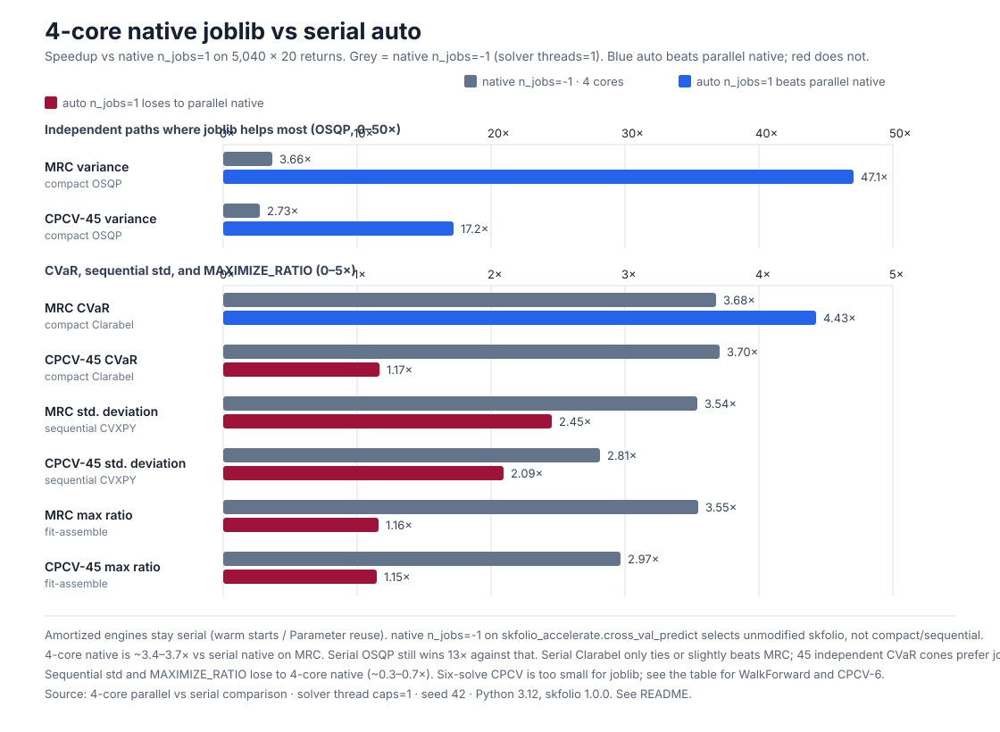

# skfolio-accelerate

> **Experimental library.** Formulations, eligibility gates, and numerical
> paths may change between releases. Validate accelerated results against
> native skfolio on workloads that matter to you. See the documentation
> section *Methods, mathematics, and assumptions* for the math behind the
> speedups and the assumptions they rely on.

`skfolio-accelerate` makes large skfolio backtests less repetitive. It provides
a drop-in replacement for `skfolio.model_selection.cross_val_predict`, so an
existing backtest usually needs one import change:

```python
from skfolio.model_selection import WalkForward
from skfolio.optimization import MeanRisk
from skfolio_accelerate import cross_val_predict

cv = WalkForward(train_size=2 * 252, test_size=21)
prediction = cross_val_predict(MeanRisk(), X, cv=cv)
```

The result is still a skfolio `MultiPeriodPortfolio` or `Population`.

Internally a call is compiled once (`cv_plan`) then executed.
`backend="auto"` covers every `ObjectiveFunction` × `RiskMeasure` pair on
WalkForward, MultipleRandomizedCV, and CombinatorialPurgedCV:

- overlapping training moments are updated from sufficient statistics;
- boxed variance uses a compact OSQP QP reused across folds;
- boxed scenario LPs (MAD, CVaR, …) use a persistent HiGHS simplex basis;
- other boxed scenario cones use a compact Clarabel problem;
- other MeanRisk configurations reuse skfolio's own CVXPY problem
  (`mu`, scenario returns, and covariance square-root are `cp.Parameter`);
- test portfolios are assembled from `weights_`.

Estimators that cannot reuse a compiled problem still call native `fit`, then
use that same assembly path unless the call needs sequential
`previous_weights`, a pipeline, parallel `n_jobs`, or another option that
changes how `predict` is called.

## What it does

Backtests repeatedly fit nearly identical portfolios. This package recognises
the cases where that repetition can be removed without changing the portfolio
problem:

- It updates empirical moments as a training window moves.
- It assembles CPCV training moments from fold blocks, including purge and
  embargo exclusions.
- It reuses a compact OSQP, HiGHS, or Clarabel problem shape for boxed MeanRisk.
- It reuses skfolio's MeanRisk CVXPY graph across folds when extra options
  keep a fixed training length.
- It scores compact hyperparameter candidates from weights before constructing
  the final portfolio objects.
- It compiles the CV plan once and builds test portfolios from `weights_`, so
  serial calls skip joblib, `safe_split` copies, and `predict()` construction.

All reuse is local to one call. The package does not keep global caches of
returns, estimators, fitted priors, or portfolios.

The EqualWeighted speedup is this last step, not a hidden solver trick. Native
`cross_val_predict` still clones the estimator, validates a DataFrame/array
slice, wraps `n_jobs=1` in joblib, copies the test fold, and constructs a
`Portfolio` for every split. EqualWeighted has no optimisation, so removing
that CV tax is the whole gain. It is a roughly constant saving per fold, not a
multiplicative floor: a cheap estimator shows a large ratio; a CVXPY solve
that already dominates the fold only shrinks by that same overhead.

## When it helps

Leave `backend="auto"`. The policy picks the first eligible engine:

1. compact OSQP (boxed variance) / HiGHS (boxed LP) / Clarabel
   (boxed scenario cones) / closed-form EqualWeighted, Random, or InverseVolatility;
2. Parameterized CVXPY reuse (`cvxpy-sequential`) for other MeanRisk
   configurations with a fixed training shape;
3. native `fit` plus assembly from `weights_`;
4. unmodified skfolio.

Sequential reuse covers standard deviation, Ulcer, `MAXIMIZE_RETURN`, risk
limits (`min_return`, …), linear constraints, management fees, and L1. The
formulation stays skfolio's: this package only Parameterizes expected return,
scenario returns, covariance square-root, and the default MAR used by
downside measures.

Not sequential (fit-assemble or native skfolio):

- `MAXIMIZE_RATIO` (no Charnes–Cooper homogenization proxy);
- transaction costs / turnover (`needs_previous_weights`);
- `add_constraints` / `add_objective` / `overwrite_expected_return`;
- uncertainty sets, `max_tracking_error`;
- MeanRisk subclasses;
- pipelines, `n_jobs != 1` (that argument selects unmodified skfolio), and
  other options that change `predict`.

Gini mean-difference is sequential-eligible but omitted from the default
benchmark: a year-long training window is a ~20-minute LP per side and stays
~1×.

This boundary is intentional. Reusing mutable estimator or solver state without
proving equivalence could silently solve a different investment problem.

Pass `return_report=True` if you want to see which engine `backend="auto"`
selected and why:

```python
prediction, report = cross_val_predict(
    MeanRisk(),
    X,
    cv=cv,
    return_report=True,
)
print(report.backend, report.reason)
```

You do not pass an engine name in application code. `"osqp"`, `"highs"`,
`"clarabel"`, and `"cvxpy-sequential"` are the policy's choices, not a user
setting.
`"sklearn"` means native skfolio was used; `report.reason` explains why. If a
compact or sequential numerical solve cannot finish, the package retries with
native `fit` and the assembled path rather than returning an
accelerator-only failure.

Boxed MAD and first lower partial moment on `CombinatorialPurgedCV` never
enter HiGHS. Those training sets are block unions, not rolling windows: a
persistent simplex basis was **slower** than native Clarabel on 20-year
windows (~0.5×). `backend="auto"` emits `AccelerationWarning` and calls
unmodified skfolio. CVaR and worst realization on CPCV stay on HiGHS.
WalkForward and MultipleRandomizedCV keep HiGHS for all four boxed LPs
(`l2_coef=0`).

## Checking a result

Use native skfolio as the reference when validating a new workload. Numerical
closeness does not automatically mean that a ranking is unchanged:

```python
from skfolio_accelerate import (
    ranking_precision_at_k,
    spearman_rank_correlation,
)

precision = ranking_precision_at_k(reference_scores, accelerated_scores, k=5)
correlation = spearman_rank_correlation(reference_scores, accelerated_scores)

# Treat score gaps below the numerical tolerance as ties.
tie_aware = ranking_precision_at_k(
    reference_scores,
    accelerated_scores,
    k=5,
    score_tolerance=1e-6,
)
```

Precision@k checks whether skfolio's best candidates remain in the best set.
The optional tolerance treats near-equal scores as ties. Spearman compares the
full ordering. It is `nan` when every score is the same.

## Parameter search

`grid_search` evaluates a compact MeanRisk parameter grid with one shared CV
plan. Every candidate must be compact-eligible (boxed OSQP / Clarabel). Ratio
objectives, risk limits, linear constraints, and other sequential MeanRisk
options are not searched here — use skfolio or sklearn search for those, and
for non-MeanRisk estimators.

```python
import numpy as np
from skfolio_accelerate import grid_search

result = grid_search(
    MeanRisk(),
    X,
    {"l2_coef": np.logspace(-5, -1, 16)},
    cv=cv,
)

print(result.best_params_)
print(result.best_score_)
prediction = result.best_prediction_
```

## Benchmarks

The canonical MeanRisk `cross_val_predict` suite lives in
[`benchmark/`](benchmark/README.md). For PR performance claims, run **in-run
relative** benchmarking (`main` then the PR on the same machine): see
[`AGENTS.md`](AGENTS.md).

```bash
python benchmark/run_relative.py --base origin/main --quick --workers 1
python benchmark/run_benchmark.py --dataset synthetic
python benchmark/run_benchmark.py --dataset sp500
```

The scripts in `benchmarks/` are exploratory / README-figure sources. Prefer
`benchmark/` for performance and numerical regressions.

`backend="auto"` is measured on every non-annualized `ObjectiveFunction` ×
`RiskMeasure` pair, plus a few extra MeanRisk options, across three CV
protocols. The large multiplicative win is still **boxed variance with many
overlapping OSQP folds**. Sequential reuse is about **2×** on those same
WalkForward / MRC windows. A six-solve CPCV on the same 20-year sample is
near **1×**, and sequential Ulcer / exponential-cone graphs can be slower than
native when the training length changes.


The large test is 5,040 × 20 synthetic daily returns, native `n_jobs=1`, one
isolated process (Python 3.12, skfolio 1.0.0, seed 42). Geometric means over
ok cells:

| Engine | WalkForward (228) | MRC (480) | CPCV (6) |
|---|---:|---:|---:|
| OSQP | 50.0× (46.7–53.4, n=2) | 41.5× (35.7–48.2, n=2) | 11.0× (10.8–11.3, n=2) |
| Clarabel | 2.32× (1.74–3.51, n=18) | 3.05× (2.28–4.54, n=18) | 0.95× (0.54–1.12, n=20) |
| Sequential | 2.35× (1.74–2.94, n=23) | 2.19× (1.74–2.59, n=18) | 0.82× (0.09–2.82, n=23) |
| Fit-assemble | 1.04× (0.71–1.20, n=14) | 1.12× (1.08–1.18, n=12) | 1.02× (0.94–1.16, n=13) |
| All ok cells | 2.14× (n=57) | 2.36× (n=50) | 0.99× (n=58) |

Minimize-risk, same 20-year sample:

| Risk | WalkForward (228) | MRC (480) | CPCV (6) | Engine |
|---|---:|---:|---:|---|
| Variance | 46.7× | 48.2× | 10.8× | OSQP |
| CVaR | 3.38× | 4.33× | 1.05× | Clarabel |
| Worst realization | 2.54× | 3.51× | 0.91× | Clarabel |
| MAD | 2.40× | 3.23× | 0.85× | Clarabel |
| First lower partial moment | 2.35× | 3.31× | 0.96× | Clarabel |
| Semi-variance | 2.29× | 3.05× | 0.97× | Clarabel |
| Max drawdown | 2.11× | 2.62× | 1.07× | Clarabel |
| CDaR | 2.07× | 2.46× | 0.94× | Clarabel |
| Semi-deviation | 2.05× | 2.64× | 1.01× | Clarabel |
| Average drawdown | 1.74× | 2.28× | 0.54× | Clarabel |
| Standard deviation | 2.58× | 2.44× | 1.59× | Sequential |
| Ulcer | 1.74× | 1.74× | 0.12× | Sequential |
| EVaR | 0.71× | fail | 1.12× | Compact Clarabel retried native on WalkForward |
| EDaR | fail | fail | fail | Native Clarabel `SolverError` |

Sequential extras (WalkForward / CPCV; MRC skipped because named constraints
fail on asset subsets and `min_return` can be infeasible on random windows):

| Extra | WalkForward (228) | CPCV (6) |
|---|---:|---:|
| Variance + `min_return` | 2.94× | 1.73× |
| Variance + linear constraints | 2.82× | 1.68× |
| Variance + L1 | 2.73× | 1.65× |
| Variance + management fees | 2.68× | 1.60× |
| CVaR + `min_return` | 2.12× | 0.97× |
| Variance `MAXIMIZE_RETURN` | 2.74× | 1.65× |
| Variance `MAXIMIZE_RATIO` | 1.15× | 1.16× |

`MAXIMIZE_RATIO` is fit-assemble on every risk that finished (~1.05–1.20×).
Sequential CPCV rebuilds (5 of 6 folds) of Ulcer and of
`MAXIMIZE_RETURN` EVaR / EDaR are **0.09–0.14×** versus native: the compiled
graph is large, and a changing training length pays the construction cost
again.

### Boxed LPs with persistent HiGHS (`l2_coef=0`)

Native skfolio vs `backend="auto"` on 5,040 × 20 synthetic daily returns.
Sharpe is the mean of path Sharpes. MAD/FLPM on CPCV are **not** accelerated
(see warning above); the rows below for those cells are the HiGHS experiment
that motivated the native fallback.

| Risk | WalkForward (228) | MRC (288) | CPCV (15) | Engine |
|---|---:|---:|---:|---|
| MAD | 6.5× | 6.8× | 0.51× (now native) | HiGHS / native |
| First lower partial moment | 6.5× | 6.9× | 0.52× (now native) | HiGHS / native |
| CVaR | 11.7× | 11.4× | 1.3× | HiGHS |
| Worst realization | 12.6× | 13.5× | 3.6× | HiGHS |

Mean path Sharpe matched native (typical Δ ~ 1e-6). CSV:
`benchmarks/lp_cv_speedups_20y.csv`. Scripts:
`experiments/parametric_lp_cv.py`, `benchmarks/benchmark_lp_cv.py`.

On the small 120 × 6 suite every fold still pays CVXPY setup, so compact
scenario risks look closer to variance. That ratio does not survive once the
cone solve dominates. Closed-form EqualWeighted / Random / InverseVolatility
skip native CV machinery (about 5–13× on this tiny problem). Serial estimators
that still call native `fit` (HRP, …) are 1.05–2.1× — the same overhead cut,
not a compact solver. Pipelines stay on native skfolio (~1×). Peak RSS is
typically similar to native because importing Python and skfolio dominates
these processes.


### Parallel folds and solver threads

Amortized engines stay serial: OSQP/Clarabel warm starts and Parameterized
CVXPY reuse a single compiled problem. MRC asset-subset paths and CPCV
combinations are independent, so native skfolio can use joblib. Passing
`n_jobs=-1` to `skfolio_accelerate.cross_val_predict` selects unmodified
skfolio, not compact or sequential.

The fair multi-core comparison is therefore **native `n_jobs=-1` with solver
threads capped to 1** versus **serial `backend="auto"`**. This machine has 4
CPUs. Native joblib scales about **3.4–3.7×** on WalkForward / MRC (close to
the core count). Serial OSQP still wins by an order of magnitude; serial
Clarabel only ties or slightly beats 4-core native on MRC; 45 independent
CVaR cones prefer joblib.



Speedup versus native `n_jobs=1` (same 5,040 × 20 sample, thread caps = 1):

| Case | CV | native 1 | native −1 | auto | auto vs 1 | auto vs −1 | Engine |
|---|---|---:|---:|---:|---:|---:|---|
| Variance | WalkForward (228) | 2.25 s | 0.67 s | 0.049 s | 45.9× | **13.6×** | OSQP |
| Variance | MRC (480) | 4.33 s | 1.18 s | 0.092 s | 47.1× | **12.9×** | OSQP |
| Variance | CPCV-45 | 0.44 s | 0.16 s | 0.025 s | 17.2× | **6.3×** | OSQP |
| CVaR | WalkForward (228) | 3.17 s | 0.91 s | 0.93 s | 3.42× | 0.99× | Clarabel |
| CVaR | MRC (480) | 5.93 s | 1.61 s | 1.34 s | 4.43× | **1.20×** | Clarabel |
| CVaR | CPCV-45 | 6.58 s | 1.78 s | 5.65 s | 1.17× | **0.31×** | Clarabel |
| Std. deviation | WalkForward (228) | 1.94 s | 0.58 s | 0.78 s | 2.50× | 0.74× | Sequential |
| Std. deviation | MRC (480) | 4.05 s | 1.14 s | 1.65 s | 2.45× | 0.69× | Sequential |
| Std. deviation | CPCV-45 | 0.43 s | 0.15 s | 0.21 s | 2.09× | 0.74× | Sequential |
| Max ratio · variance | MRC (480) | 4.76 s | 1.34 s | 4.10 s | 1.16× | 0.33× | Fit-assemble |
| Max ratio · variance | CPCV-45 | 0.49 s | 0.17 s | 0.43 s | 1.15× | 0.39× | Fit-assemble |

Six-solve CPCV (`n_folds=4`) is too small for joblib: variance only goes
0.059 s → 0.038 s. CPCV-45 is `CombinatorialPurgedCV(n_folds=10, n_test_folds=2)`.

When you *do* use native skfolio, sklearn `GridSearchCV`, or
`cross_val_score` with `n_jobs=-1`, pin solver-internal threads to 1 so
workers do not oversubscribe the machine:

```python
import os

for key in (
    "OMP_NUM_THREADS",
    "OPENBLAS_NUM_THREADS",
    "MKL_NUM_THREADS",
    "NUMEXPR_NUM_THREADS",
):
    os.environ.setdefault(key, "1")

from skfolio.optimization import MeanRisk

estimator = MeanRisk(solver_params={"max_threads": 1})
```

`cross_val_predict` already sets those OpenMP/BLAS variables and compact
Clarabel uses `max_threads=1`. On this MRC variance cell, native
`n_jobs=-1` was 1.19 s with either 1 or 4 BLAS threads: the run is
Clarabel-bound, not BLAS-bound. The cap still matters for OSQP/OpenBLAS
workloads and for mixed joblib pools.

For exploratory hyperparameter search on **native** MeanRisk, relaxing
Clarabel gaps from the default to `1e-4` can cut short-window solves
without moving allocations. A 252-day 20-asset CVaR `fit` went 18.4 ms →
13.0 ms (**1.42×**) with `max |Δw| = 0`. On 756-day and 20-year windows the
same change did **not** move wall time: CVXPY construction dominates.
`grid_search` is the better lever for compact MeanRisk: eight `l2_coef`
candidates on the 20-year WalkForward took **4.72 s** as a native
`ParameterGrid` with `n_jobs=-1`, versus **0.14 s** for compact
`grid_search` (**34×**), still at the tight OSQP/Clarabel tolerances.

```python
from skfolio import RiskMeasure
from skfolio.optimization import MeanRisk

MeanRisk(
    risk_measure=RiskMeasure.CVAR,
    solver_params={"tol_gap_abs": 1e-4, "tol_gap_rel": 1e-4},
)
```

The project does not claim one universal speedup number. Measured results
depend on data shape, how many overlapping training windows you actually
run, and whether native skfolio is allowed to use every core.

Compare native skfolio to `backend="auto"` across every
`ObjectiveFunction` × non-annualized `RiskMeasure` on WalkForward,
MultipleRandomizedCV, and CombinatorialPurgedCV (the library picks OSQP,
HiGHS, Clarabel, sequential CVXPY, or fit-assemble; you do not pass an engine name):

```bash
PYTHONPATH=src python benchmarks/benchmark_sequential_mean_risk.py --repeats 1
PYTHONPATH=src python benchmarks/benchmark_sequential_mean_risk.py --quick
PYTHONPATH=src python benchmarks/benchmark_parallel_cv.py
PYTHONPATH=src python benchmarks/render_readme_figures.py
```

The compact-only matrix (five boxed risks, median of three isolated runs) is
still available:

```bash
PYTHONPATH=src python benchmarks/benchmark_matrix.py --quick --repeats 3
PYTHONPATH=src python benchmarks/benchmark_matrix.py --repeats 3 \
  --only 'MeanRisk[VARIANCE]' \
  --only 'MeanRisk[SEMI_VARIANCE]' \
  --only 'MeanRisk[MEAN_ABSOLUTE_DEVIATION]' \
  --only 'MeanRisk[CVAR]' \
  --only 'MeanRisk[MAX_DRAWDOWN]'
```

`benchmark_matrix.py --native-n-jobs=-1` is the isolated-process version of
the same parallel comparison. Native `n_jobs=1` remains the correctness
baseline. The matrix CSV keeps compact and fallback rows separate and
includes timing spread, peak RSS, numerical difference, rankings, solver
counts, and fallback reasons.

## Documentation

API reference, user guide (including methods / mathematics / assumptions), and
gallery examples are built with Sphinx (numpydoc + pydata-sphinx-theme,
matching skfolio's documentation style). The gallery runs Plotly figures that
illustrate measured speedups after the usage examples; CI executes those
examples on every pull request and push.

```bash
pip install -e ".[docs]"
cd docs && make html
```

Open `docs/_build/html/index.html`. Continuous integration builds the docs on
every pull request and publishes them to GitHub Pages from `main`. For a local
stub build that skips executing examples, set
`SKFOLIO_ACCELERATE_DOCS_FAST=1`.

## Installation and tests

The package targets skfolio 1.x. Its only additional runtime dependency is
OSQP; NumPy, SciPy, Clarabel, and scikit-learn come from skfolio's own runtime
stack.

```bash
uv sync --extra dev
source .venv/bin/activate
pytest
```

This uses the project's `.python-version` pin (Python 3.12). `uv` installs that
interpreter if needed, creates `.venv`, and installs the package in editable
mode with the `dev` extras.

## Automation and releases

Every pull request and push to `main` runs Ruff, the complete test suite on
Python 3.10 through 3.14, a coverage report, and a wheel/sdist build with an
installation smoke test. Dependabot checks Python and GitHub Actions
dependencies weekly.

Publishing a non-prerelease GitHub Release automatically verifies the source,
checks that a tag such as `v0.1.0` matches the version in `pyproject.toml`,
builds the distributions, and publishes them to PyPI. PyPI Trusted Publishing
must be configured once for this repository, the `release.yml` workflow, and
the `pypi` GitHub environment; no API token is stored in GitHub.
