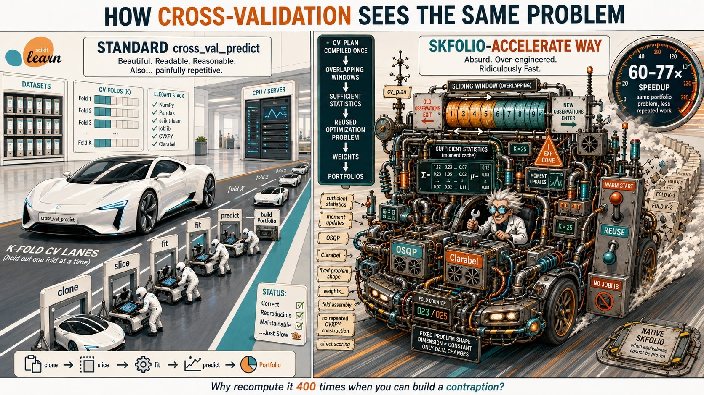

# skfolio-accelerate



> **WARNING Experimental non-production library.** Hi, this is a human writing this warning. `skfolio-accelerate` is an ongoing fully AI-supported (almost 100% vibecoded) experiment I am doing in spare time. Despite being promising, I cannot guarantee on 1. correctness of results, 2. stability of the code, 3. other unknown unkowns which I am unaware of. Use at your own risk. For the rest I promise it is pure fun!

`skfolio-accelerate` makes large skfolio backtests less repetitive.

The only goal of this **experiment** is to understand how to squeeze the most performance from cross-validation with `skfolio` as I think that repeatedly solving independent problems in cross-validation like WalkForward with its highly sequential nature is a waste of CPU cycles.

It seems that this is possible thanks to solvers improving from previous solutions (warm-starts) and other tricks that the sequential nature of various cross-validation structure induces on the problems.

`skfolio-accelerate` goal is to provide a drop-in replacement for `skfolio.model_selection.cross_val_predict`, so an existing backtest usually needs one import change:

```python
from skfolio.model_selection import WalkForward
from skfolio.optimization import MeanRisk
from skfolio_accelerate import cross_val_predict

cv = WalkForward(train_size=2 * 252, test_size=21)
prediction = cross_val_predict(MeanRisk(), X, cv=cv)
```

The result is still a skfolio `MultiPeriodPortfolio` or `Population`.

Internally a call is compiled once (`cv_plan`) then executed.
I've combinatorially tested with `backend="auto"` that every combination `ObjectiveFunction` × `RiskMeasure` is supported for the `MeanRisk` convex optimization estimator over a variety of cross-validation methods, namely `WalkForward`, `MultipleRandomizedCV`, and `CombinatorialPurgedCV`.

It appears that problems with *easy* constraints (like box constraints, budget etc) are amenable to large speedups thanks to solvers like [OSQP](https://osqp.org/docs/solver/index.html) or [HiGHS](https://highs.dev/).

There are other few computational tricks to squeeze further CPU cycles:

- overlapping training moments are updated from sufficient statistics;
- boxed maximum-return portfolios use an analytic L2-regularized projection;
- boxed variance uses a compact OSQP QP reused across folds;
- boxed standard deviation uses a persistent compact Clarabel SOCP;
- boxed scenario LPs (MAD, CVaR, …) use a persistent HiGHS simplex basis;
- other boxed scenario cones use a compact Clarabel problem;
- other MeanRisk configurations reuse skfolio's own CVXPY problem
(`mu`, scenario returns, and covariance square-root are `cp.Parameter`);
- every serial estimator shares one compiled CV plan, contiguous slices, and
assembly from `weights_` (skipping joblib, `safe_split` copies, and
`predict()`). That bookkeeping is independent of MeanRisk. Estimators with
trivial weights skip `fit`; the others still call native `fit` and then use
the same assembly unless the call needs sequential `previous_weights`, a
pipeline, parallel `n_jobs`, or another option that changes how `predict`
is called.


## More in detail

Backtests repeatedly fit nearly identical portfolios. This package recognises the cases where that repetition can be removed without changing the portfolio problem:

- It updates empirical moments as a training window moves.
- It assembles CPCV training moments from fold blocks, including purge and embargo exclusions.
- It reuses a compact OSQP, HiGHS, or Clarabel problem shape for boxed MeanRisk.
- It reuses skfolio's MeanRisk CVXPY graph across folds when extra options keep a fixed training length.
- It scores compact hyperparameter candidates from weights before constructing the final portfolio objects.
- It compiles the CV plan once and builds test portfolios from `weights_`.
That Python-side path (views instead of copies, no joblib, no per-fold
`predict()`) is shared by every serial estimator, not only MeanRisk.

All reuse is local to one call. The package does not keep global caches of returns, estimators, fitted priors, or portfolios.

## When it helps

Leave `backend="auto"` uses the optimally found strategy for the given `MeanRisk` selected `ObjectiveFunction`, `RiskMeasure` and other constraints that you have specified.
The policy that comes from manually selected benchmarks, picks the best engine:

1. analytic maximum-return / compact OSQP (boxed variance) / HiGHS (boxed LP) /
  Clarabel (boxed scenario cones)
2. Parameterized CVXPY reuse (`cvxpy-sequential`) for other MeanRisk configurations with a fixed training shape;
3. serial assembly from `weights_` (native `fit` unless the weights are a trivial formula);
4. unmodified skfolio.

`"osqp"`, `"highs"`, `"clarabel"`, and `"cvxpy-sequential"` are the policy's choices, not a user setting.
If a compact or sequential numerical solve cannot finish, the package retries with native `fit` and the assembled path rather than returning an accelerator-only failure.

## Checking a result

Use native skfolio as the reference, for example on large hyperparameters sweep when refitting a selected model.
Numerical closeness of the amortized version provided by `skfolio-accelerate` is not a guarantee that the obtained final weights are machine-precision close to the ones obtained with native `skfolio` Clarabel solver.

You can measure agreement between `skfolio-accelerate` results and native `skfolio` with the provided metrics, ranking precision@k and spearman correlation over path Sharpe ratios.

```python
from skfolio_accelerate import (
    ranking_precision_at_k,
    spearman_rank_correlation,
)

precision = ranking_precision_at_k(reference_scores, accelerated_scores, k=5)
correlation = spearman_rank_correlation(reference_scores, accelerated_scores)

# Treat score gaps below the numerical tolerance as ties.
tie_aware = ranking_precision_at_k(
    reference_scores,
    accelerated_scores,
    k=5,
    score_tolerance=1e-6,
)
```

Precision@k checks whether skfolio's best candidates remain in the best set.
The optional tolerance treats near-equal scores as ties. Spearman compares the
full ordering. It is `nan` when every score is the same.

## Parameter search

`grid_search` evaluates a compact MeanRisk parameter grid with one shared CV
plan. Every candidate must be compact-eligible (boxed OSQP / Clarabel). Ratio
objectives, risk limits, linear constraints, and other sequential MeanRisk
options are not searched here — use skfolio or sklearn search for those, and
for non-MeanRisk estimators.

```python
import numpy as np
from skfolio_accelerate import grid_search

result = grid_search(
    MeanRisk(),
    X,
    {"l2_coef": np.logspace(-5, -1, 16)},
    cv=cv,
)

print(result.best_params_)
print(result.best_score_)
prediction = result.best_prediction_
```


## Benchmarks

The canonical MeanRisk `cross_val_predict` suite lives in
`[benchmark/](benchmark/README.md)`. For PR performance claims, run **in-run
relative** benchmarking (`main` then the PR on the same machine): see
`[AGENTS.md](AGENTS.md)`.

```bash
python benchmark/run_relative.py --base origin/main --quick --workers 1
python benchmark/run_benchmark.py --dataset synthetic
python benchmark/run_benchmark.py --dataset sp500
```

`backend="auto"` is measured on every non-annualized `ObjectiveFunction` ×
`RiskMeasure` pair, plus a few extra MeanRisk options, across three CV
protocols. The large multiplicative win is still **boxed variance with many
overlapping OSQP folds**. Sequential reuse is about **2×** on those same
WalkForward / MRC windows. A six-solve CPCV on the same 20-year sample is
near **1×**, and sequential Ulcer / exponential-cone graphs can be slower than
native when the training length changes.

The tables below are **representative medians from one 20-year host**. They
are not a PR timing baseline; coding agents must use in-run
`benchmark/run_relative.py` (see `[AGENTS.md](AGENTS.md)`).

Engine labels in the first two tables follow the compact Clarabel path that
was `auto` for scenario risks in that sweep. Boxed LPs (`l2_coef=0`) now
select persistent HiGHS on WalkForward / MRC; CombinatorialPurgedCV MAD and
FLPM use native skfolio. The HiGHS subsection is the current boxed-LP
picture. Do not mix these rows with a `results.csv` from another machine.


The large test is 5,040 × 20 synthetic daily returns, native `n_jobs=1`, one
isolated process (Python 3.12, skfolio 1.0.0, seed 42). Geometric means over
ok cells:


| Engine       | WalkForward (228)       | MRC (480)               | CPCV (6)                |
| ------------ | ----------------------- | ----------------------- | ----------------------- |
| OSQP         | 50.0× (46.7–53.4, n=2)  | 41.5× (35.7–48.2, n=2)  | 11.0× (10.8–11.3, n=2)  |
| Clarabel     | 2.32× (1.74–3.51, n=18) | 3.05× (2.28–4.54, n=18) | 0.95× (0.54–1.12, n=20) |
| Sequential   | 2.35× (1.74–2.94, n=23) | 2.19× (1.74–2.59, n=18) | 0.82× (0.09–2.82, n=23) |
| Fit-assemble | 1.04× (0.71–1.20, n=14) | 1.12× (1.08–1.18, n=12) | 1.02× (0.94–1.16, n=13) |
| All ok cells | 2.14× (n=57)            | 2.36× (n=50)            | 0.99× (n=58)            |


Minimize-risk, same 20-year sample:


| Risk                       | WalkForward (228) | MRC (480) | CPCV (6) | Engine                                         |
| -------------------------- | ----------------- | --------- | -------- | ---------------------------------------------- |
| Variance                   | 46.7×             | 48.2×     | 10.8×    | OSQP                                           |
| CVaR                       | 3.38×             | 4.33×     | 1.05×    | Clarabel                                       |
| Worst realization          | 2.54×             | 3.51×     | 0.91×    | Clarabel                                       |
| MAD                        | 2.40×             | 3.23×     | 0.85×    | Clarabel                                       |
| First lower partial moment | 2.35×             | 3.31×     | 0.96×    | Clarabel                                       |
| Semi-variance              | 2.29×             | 3.05×     | 0.97×    | Clarabel                                       |
| Max drawdown               | 2.11×             | 2.62×     | 1.07×    | Clarabel                                       |
| CDaR                       | 2.07×             | 2.46×     | 0.94×    | Clarabel                                       |
| Semi-deviation             | 2.05×             | 2.64×     | 1.01×    | Clarabel                                       |
| Average drawdown           | 1.74×             | 2.28×     | 0.54×    | Clarabel                                       |
| Standard deviation         | 2.58×             | 2.44×     | 1.59×    | Sequential                                     |
| Ulcer                      | 1.74×             | 1.74×     | 0.12×    | Sequential                                     |
| EVaR                       | 0.71×             | fail      | 1.12×    | Compact Clarabel retried native on WalkForward |
| EDaR                       | fail              | fail      | fail     | Native Clarabel `SolverError`                  |


Sequential extras (WalkForward / CPCV; MRC skipped because named constraints
fail on asset subsets and `min_return` can be infeasible on random windows):


| Extra                         | WalkForward (228) | CPCV (6) |
| ----------------------------- | ----------------- | -------- |
| Variance + `min_return`       | 2.94×             | 1.73×    |
| Variance + linear constraints | 2.82×             | 1.68×    |
| Variance + L1                 | 2.73×             | 1.65×    |
| Variance + management fees    | 2.68×             | 1.60×    |
| CVaR + `min_return`           | 2.12×             | 0.97×    |
| Variance `MAXIMIZE_RETURN`    | 2.74×             | 1.65×    |
| Variance `MAXIMIZE_RATIO`     | 1.15×             | 1.16×    |


`MAXIMIZE_RATIO` is fit-assemble on every risk that finished (~1.05–1.20×).
Sequential CPCV rebuilds (5 of 6 folds) of Ulcer and of
`MAXIMIZE_RETURN` EVaR / EDaR are **0.09–0.14×** versus native: the compiled
graph is large, and a changing training length pays the construction cost
again.

### Boxed LPs with persistent HiGHS (`l2_coef=0`)

Native skfolio vs `backend="auto"` on 5,040 × 20 synthetic daily returns.
Sharpe is the mean of path Sharpes. MAD/FLPM on CPCV are **not** accelerated
(see warning above); the rows below for those cells are the HiGHS experiment
that motivated the native fallback.


| Risk                       | WalkForward (228) | MRC (288) | CPCV (15)          | Engine         |
| -------------------------- | ----------------- | --------- | ------------------ | -------------- |
| MAD                        | 6.5×              | 6.8×      | 0.51× (now native) | HiGHS / native |
| First lower partial moment | 6.5×              | 6.9×      | 0.52× (now native) | HiGHS / native |
| CVaR                       | 11.7×             | 11.4×     | 1.3×               | HiGHS          |
| Worst realization          | 12.6×             | 13.5×     | 3.6×               | HiGHS          |


Mean path Sharpe matched native (typical Δ ~ 1e-6). Reproduce with
`python benchmark/run_benchmark.py` (`include_lp_l2_zero` is on by default).

On the small 120 × 6 suite every fold still pays CVXPY setup, so compact
scenario risks look closer to variance. That ratio does not survive once the
cone solve dominates. Serial assembly (the compiled plan, views, and
`weights_` portfolios) is the same path for every non-compact estimator.
When `fit` is free the ratio on this tiny problem looks like 5–13×; when
`fit` still runs (HRP, …) it is 1.05–2.1× — the same constant CV overhead,
not a compact solver. Pipelines stay on native skfolio (~1×). Peak RSS is
typically similar to native because importing Python and skfolio dominates
these processes.


### Parallel folds and solver threads

Amortized engines stay serial as OSQP/Clarabel warm starts and Parameterized CVXPY must reuse a single compiled problem.
On WalkForward more cores cannot exploit serial nature of the job, while MRC asset-subset paths and CPCV combinations are independent, so native skfolio can use joblib.
Passing `n_jobs=-1` to `skfolio_accelerate.cross_val_predict` falls back to native `cross_val_predict`.

As a suggestion for parallel CV workloads, when you *do* use native skfolio, as in sklearn `GridSearchCV`, or `cross_val_score` with `n_jobs=-1`, pin solver-internal threads to 1 so workers do not oversubscribe the CPU cores, causing overhead and scheduler slowdowns.

```python
import os

for key in (
    "OMP_NUM_THREADS",
    "OPENBLAS_NUM_THREADS",
    "MKL_NUM_THREADS",
    "NUMEXPR_NUM_THREADS",
):
    os.environ.setdefault(key, "1")

from skfolio.optimization import MeanRisk

estimator = MeanRisk(solver_params={"max_threads": 1})
```

`skfolio_accelerate.cross_val_predict` already sets those OpenMP/BLAS variables and compact Clarabel uses `max_threads=1` for you.

For exploratory hyperparameter search on **native** `MeanRisk`, relaxing Clarabel gaps from the default to `1e-4` can cut short-window solves without moving allocations.

```python
from skfolio import RiskMeasure
from skfolio.optimization import MeanRisk

estimator = MeanRisk(
    risk_measure=RiskMeasure.CVAR,
    solver_params={"tol_gap_abs": 1e-4, "tol_gap_rel": 1e-4},
)
```


## Provide your idea for speedup

Reproducibility and relative speedup are enforced by using the provided `benchmark` that checks every combination of `MeanRisk`'s `ObjectiveFunction` and `RiskMeasure`, maintaining a SOTA over different git commits.

## Documentation

See `[CHANGELOG.md](CHANGELOG.md)` for the 0.1.0 surface. To build the Sphinx
site:

```bash
pip install -e ".[docs]"
cd docs && make html
```

Then open `docs/_build/html/index.html` in your browser.

## Developer installation

The package targets `skfolio>=1.0.0` and I don't plan support for older versions because of substantial API changes.
Runtime extras beyond skfolio are OSQP and HiGHS (`osqp`, `highspy`).

```bash
uv sync --extra dev
source .venv/bin/activate
pytest
```

## About other solvers: COSMO.rs

Beside this repo lives [`COSMO.rs`](https://github.com/carlonicolini/COSMO.rs)—my Rust port of Oxford’s COSMO—so a persistent ADMM solver workspace can update `P`/`q`/`A` between folds, on conic problems.
Persistence cuts iterations; it does not (yet) beat naked OSQP on box+budget Markowitz. 
